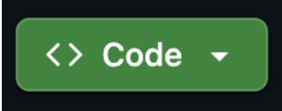
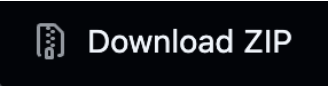
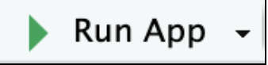
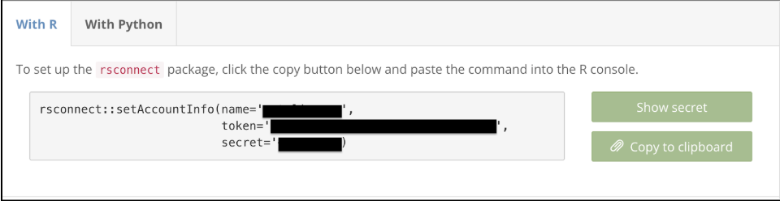
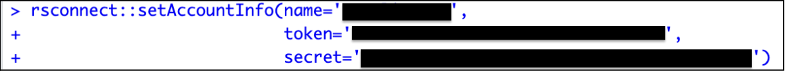
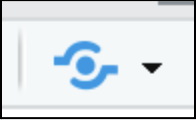
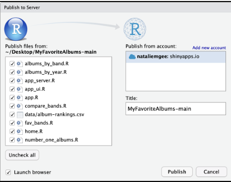

**How-To Instructions for Developers**   
These instructions are intended for developers with a beginner's knowledge of R. This document will detail installation, file setup, and launch procedures of the My Favorite Albums website in RStudio and ShinyApps. 

**Prerequisites**  
Before MyFavoriteAlbums can be installed make sure you have these items: 
- A computer running Windows, macOS, or Linux   
- Internet access  
- Basic familiarity with file navigation   
- Administrative access to install software 

1. **Installing Required Software & Tools (RStudio & Shiny)**   
   Step 1: Install R   
- Download and install the latest version of R from the CRAN Website: [https://cran.r-project.org](https://cran.r-project.org)  
- Follow the installation instruction for your operating system (Windows, macOS, or Linux)

	  
	Step 2: Install RStudio

- Download and install RStudio from the Posit Website: [https://posit.co/download/rstudio-desktop/](https://posit.co/download/rstudio-desktop/)  
- Open RStudio after installation to confirm it launches successfully. 

	Step 3: Install Required R Packages  
	Open **RStudio** and run the following commands in the **Console**:   
`install.packages("shiny")`  
`install.packages("dplyr")`   
`install.packages("ggplot2")`  
These commands are required as: 

- shiny: runs the web application framework   
- dplyr: processes and filters album data   
- ggplot2: generates graphs, charts, and data visualizations   
  Without installing these packages, the application will fail to launch and return “package not found” errors in the **Console**.   
    
  After running each command, RStudio should display a message in the **Console**  indicating that the package was successfully installed. If you see a red error message, verify internet connection and resubmit.   
    
2.  **Downloading the Favorite Albums Software Files**   
- Step 1: Download the My Favorite Albums project folder (usually provided as a ZIP file) from this git repository: [https://github.com/UW-Example-Student/MyFavoriteAlbums](https://github.com/UW-Example-Student/MyFavoriteAlbums)  
1. In the repository, navigate to the Code button. 

2. Click, Download Zip

3. Unzip the file   
- Step 2: Save the file to a known location (**Desktop or Documents**)

3. **Opening My Favorite Albums Software Files in RStudio**

Step 1\. Open RStudio.  
Step 2\. Click **Files** and open the My Favorite Albums folder located in your known location (e.g. Desktop, Documents, etc.)  
Step 3\. Open the **app.R** file from within the My Favorite Albums folder.  
Step 4\. Click **Run App** in the top right corner to launch the application.

- The application should open in the Viewer pane or your default browser. If it does not open, check the **Console** for error messages and confirm that all required packages are installed.

Step 5\. Once the website opens in viewer or on your default browser, confirm:

- Home tab displays correct totals.  
- Artists appear in dropdown menus.  
- Filters work properly.  
- Graphs render without errors.  
- No red messages appear in the **Console**.

**Developer Tutorial: Deploying My Favorite Albums to the Web**   
This tutorial will detail how to host the My Favorite Albums app online using shinyapps.io, so others can access it.   
**Step 1: Create a shinyapps.io Account** 

1. Go to [https://www.shinyapps.io/](https://www.shinyapps.io/)   
2. Click **Sign Up**  
3. Choose the free account/plan (or another if desired).   
4. Enter your email address, username, and password.  
5. Click **Sign Up**, and an account will be created.    
6. Check your email inbox for a verification message from shinyapps.io.  
7. Click the verification link in the email to activate your account.  
8. Return to the **Log In** page and enter your email and password to access your dashboard. 

**Step 2: Connect RStudio to Your Account**   
From your [shinyapps.io](http://shinyapps.io) dashboard: 

1. Click **Account → Tokens**   
2. Click **Show**  
3. Click **Show Secret**   
4. Copy the provided token instructions to clipboard.   
   - Make sure that the **With R** tab is selected

5. Paste the provided command into the RStudio **Console**. It will look like this:

6. Run the command once to authenticate it. 

**Step 3: Deploy the App** 

1. Make sure the working directory is set to the MyFavoriteAlbums folder.   
2. Before publishing, click **Run App** to confirm the application launches locally and all features function correctly.  
3. After confirmation, click the Shiny application icon to publish.  

     
4. In the **Publish to Server** popup: Select Files to Deploy   
- Verify that all files in the MyFavoriteAlbums folder are selected to publish.  
5. Make sure the **Launch Browser** box is checked.  
6. Ensure that the website is being published to the desired account.   
7. Optional: Enter a different title for the app’s public URL.

8. Click **Publish.** 

RStudio: 

- Uploads your app files  
- Installs required packages  
- Launches a live URL  
  After deployment completes, a public web page will open automatically on your default browser.   
9. Verify that the app loads correctly by testing each tab and respective features (dropdown menus, graphs, etc.).   
   

**Developer Tutorial: Creating a Custom CSV File for the “My Favorite Albums” Software**  
This tutorial will walk developers through the process of creating a properly formatted CSV file that integrates with the My Favorite Albums application. It is important to remember that the app depends on structured data. If the CSV format is incorrect, the app may fail to load and filters may not work properly.   
**Step 1: Understand the Required File Structure**   
Before creating your file, open the **MyFavoriteAlbums** folder in RStudio or within the git repository and locate the **data** folder.

1. Within the **data** folder, open **album-ranking.csv**    
2. Review how the CSV file references column names (for example: Year, Ranking, Album Artist, Rating, Vinyl, EP, Live).  
- Your CSV file must match those column names and formatting exactly, including capitalization and spelling. 

**Step 2: Column Format Structure**   
Below is the expected structure of the columns and names used by the software. 

| Year | Ranking | Album | Artist | Rating | Vinyl | EP | Live |  |
| :---- | :---- | :---- | :---- | :---- | :---- | :---- | :---- | :---- |
| **2025** | **1** | **The Life of a Showgirl**  | **Taylor Swift**  | **10** | **v** |  |  |  |

**Step 3: Create the CSV File**   
Using Excel or Google Sheets:

1. Open a blank spreadsheet.   
2. Enter the column headers in the first row exactly as shown in **Step 2**.   
3. Enter the album data starting on row 2\.   
4. Save the file as **albums.csv**.  
5. Place the file in the **MyFavoriteAlbums → data** folder.

A note on Case Sensitivity:

- File and folder names are case-sensitive when deployed in [shinyapps.io](http://shinyapps.io)  
- For example “**albums.csv**” is **NOT** the same as “**Albums.csv**”  
- Incorrect capitalization can cause deployment failures even if the app works locally on Windows or macOS.

**Data Formatting Rules** 

1. **Year** must be numeric   
2. **Ranking** must be numeric   
3. **Rating** must be numeric  
4. **Vinyl** must be marked with a lowercase **“v”**  
5. **EP** must be marked with an all caps **“EP”**  
6. **Live** must be marked as **“Live”**  
   

**Required Fields**  
Every row must contain values for the following required fields:

* Year  
* Ranking  
* Album  
* Artist  
* Rating

If any required field is missing, the dataset may not load or the application may produce errors.

**Optional Fields**  
Fields such as **Vinyl, EP, and Live** are optional, but if they are used they must follow the formatting rules listed above.

**Step 4: Replacing the CSV File** 

1. Since the CSV file has been renamed, update this line in **app\_ui.r**

	**Change:**  
`album_data <- read.csv("data/album-rankings.csv")`  
**To:**  
`album_data <- read.csv("data/albums.csv")`

Purpose:   
This change ensures the application reads the correct dataset. The **data** folder indicates the file location, and **albums.csv** is the renamed file referenced by the application.

Note:   
Make sure this file path matches the name and location of your CSV file. If the name is incorrect or the file is in the wrong folder, the app will fail to load the data set and display a file connection error.

**Step 5: Edits to MyFavoriteAlbum Files**  
Before launching the application, there are some small edits that need to be changed within: 

- **app\_ui.r**   
- **compare\_bands** 

**Manually Changing the Minimum and Maximum Year** 

1. Within **app\_ui.r,** update the slider:   
   `sliderInput("rng","Choose the Years",`   
               `value = c(0000,0000),`   
               `min = 0000,`   
               `max = 0000,`   
               `sep = "")`  
   Make sure:   
- The **min** matches your earliest year in the CSV.  
- The **max** matches your latest year,  
- The default **value** range falls within the min/max.

2. Within **compare\_bands:**   
1. Update X-Axis Breaks

`scale_x_continuous(breaks = seq(0000, 0000, 1))`

2. Update Axis Limits  
   `expand_limits(x = c(0000, 0000), y = c(0, 10))`  
   Make sure:   
- The values in **`seq()`** must match the values in **`expand_limits()`**.  
- Ensure the years match your earliest and latest dates in CSV dataset.

**Step 6: Restarting & Republishing the App**  
After modifying the CSV file, you must stop and restart the app. 

Shiny reads the dataset when the app first launches. If the app remains running, it will continue using the old data stored in memory.   
To Restart the App: 

1. In RStudio, locate the **Console** pane.  
2. If the red **Stop** icon appears in the upper-right corner of the **Console**, click it to stop the running app.  
3. If the **Stop** icon does not appear, press **Esc** on your keyboard to terminate the running process.  
4. Confirm that the **Console** prompt **`(>)`** returns. This indicates the app has successfully stopped.  
5. Open **app.R** file   
6. Click **Run App** 

Confirm:

- Home tab displays correct totals.  
- Updated artists appear in dropdown menus.  
- Filters work properly.  
- Graphs render without errors.  
- No red messages appear in the **Console**.

**To Republish the App**

1. After confirming the app runs correctly, click the **Publish** button in the upper-right corner of the RStudio script window.  
2. Select your publishing destination (for example, **shinyapps.io** or **Posit Connect**).  
3. Ensure the following files are selected for publishing:  
   * **app.R**  
   * The updated CSV data file  
4. Click the Shiny application icon.   
5. Click **Publish Application**.  
6. After deployment completes, a public web page will open automatically on your default browser.  
