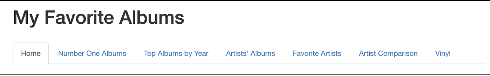
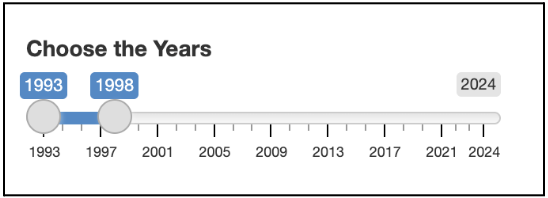
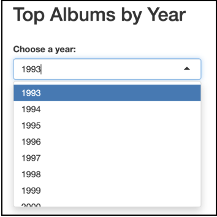
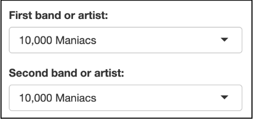
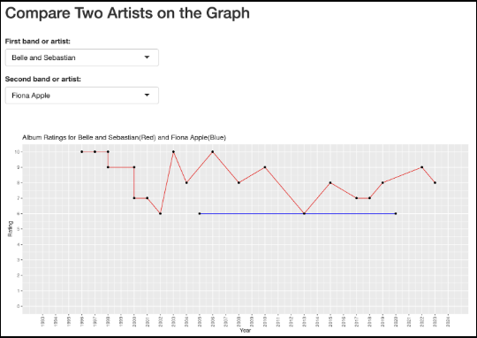

# **How-To Instructions for Users**   
These instructions are intended for end users with little programming experience. This document will detail how to navigate each tab on the My Favorite Albums website, provide tips for navigation, and troubleshooting options for the website. 

## **Tab Navigation and Result Interpretation**  
Open the **My Favorite Albums** website, using this URL: [https://cholstro.shinyapps.io/shiny \-music/](https://cholstro.shinyapps.io/shiny-music/), in your preferred web browser. You will automatically be directed to the starting page,  
**Tab 1: Home** which serves as the main landing page of the site.  

### **Tab 1: Home**   
**Purpose:** Starting point.  

**How To Use:** 
- When you open the website, you will land on the **Home** tab. 
The tab includes introductory information and an overview of the total number of albums and artists in the database. 

### **Tab 2: Number One Albums**   
**Purpose:** See which albums were \#1 rated over a range of years. 

**How To Use:**
1. Click the **Number One Albums** tab.   
2. Use the slider to select a starting year  
3. Select an ending year. 

4. Once the range is selected, view the automatically updated results.

### **Tab 3: Top Albums by Year**   
**Purpose:** View top-rated albums for a specific year.

**How To Use:**
1. Switch to the **Top Albums by Year** tab.   
2. Choose or type a specific year in the dropdown menu.

3. Click **Submit** to show the list of highest-rated albums for that year. 

### **Tab 4: Artist’s Albums**   
**Purpose:** Explore an artist's album catalog and average ratings.

**How To Use:**
1. Switch to the **Artist’s Albums** tab.   
2. In the artist dropdown menu, scroll to select a band or artist. (Artists/Bands are listed alphabetically).  
   - You can also delete the selected artist, start typing, and select the artist.  
3. Click **Submit** to display the artist’s/band’s catalog and ratings. 

   

### **Tab 5: Favorite Artists**   
**Purpose:** View artists’ average album rating and total number of albums in the database.  

**How To Use:**
1. Select **Favorite Artists** tab.  
2. Use the dropdown menu to select the **minimum number of albums** an artist must have in the database.   
3. Check or uncheck the “**Exclude EPs and Live Albums**” box depending on whether you would like those releases included in the calculation.  
4. Click **Submit** to generate a customized list of artists that match selected criteria.
    

### **Tab 6: Artist Comparison**   
**Purpose:** Compare two artists using a visual graph of their album ratings.   

**How To Use:**
1. Select **Artist Comparison** tab.  
2. Select a **First band or artist** from the first dropdown menu.  
3. Select a **Second band or artist** from the second dropdown menu.

   

4. Once both selections are made, the graph automatically updates to display the comparison.

  

### **Tab 7: Vinyl**  
**Purpose:** View top-rated albums not owned on vinyl. 

**How To Use:**
1. Select the **Vinyl** tab.   
2. Use the dropdown menu to select the minimum album rating you would like to display.  
3. Click **Submit** to generate a list of albums that meet or exceed your selected rating and are not owned on vinyl.

## **Tips For Navigating Between Tabs** 

1. Use the top menu bar, each tab label (Home, Number One Albums, Top Albums by Year, etc.) is clickable.   
2. After making selections in one tab, switching to another will keep your previous inputs saved until you reset them or reload the page.   
3. If the app seems unresponsive or slow, try refreshing the browser or re-submitting your inputs.   
   

## **Refreshing Displayed Data**  
If data doesn’t update automatically after a selection:

1. Make sure you have clicked the Submit button (if available) after selecting options.   
2. Try refreshing your browser page. (e.g., Ctrl+R / Command \+ R).
